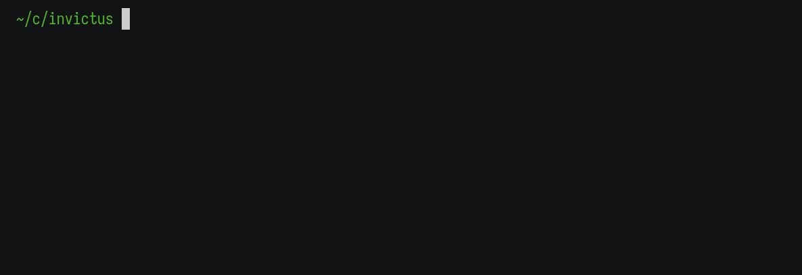

<p></p>

Snake is a high-performance build system powered by CMake and Conan that incorporates features from modern tools like NPM, Flutter, or Cargo. It works by reading a YAML file called `.snake.yml` located at the root of a directory and generating configurations based on different profiles.

The goal is to abstract away cross-platform knowledge so that developers can focus on building and deploying production-ready C++ — or perhaps multi-language — projects.

<p></p>

## Why not Meson, CMake, XMake, etc...?

- Snake wants the build system to be almost invisible to developers
  - Snake is strict and offers opinionated defaults that should "just work"
  - Snake prioritizes simplicity over extensibility
  - No need to learn a complete language like Lua or Python
  - Having only one way to do things prevents boilerplate and complexity
  - You should not have to become a toolchain expert to deploy C++ applications
- Snake wants to work well with existing CMake projects
  - You know CMake is CMake so lets just make the best of an awful situation
  - Progressively migrate your CMake project to Snake
- Snake integrates well with Qt6
  - Snake was built for a Qt-centric C++23 project
  - Makes many things easier for developers who avoid QtCreator

## Benefits

Here are a couple of features that Snake supports (or will soon enough):

- Faster than regular CMake
  - Our project with 37 unique targets took approx. 8-10 seconds for initial configuration and then 4 seconds for each subsequent run with CMake
  - Now it takes 2 seconds for the first run and **500ms** for each subsequent run
  - You can pair Snake with `ccache`, `mold`, and `ninja` to get really fast builds
- Can automatically format all source files in the repository (`snake format`)
- Focused on legibility and scalability
  - Developers only have to download dependencies for the CMake targets they have enabled
  - Scaling to dozens of targets should not be difficult or slow
- Interactive (REPL) mode
  - Great for developers who prefer to debug and build in the terminal
  - Command history
  - You can have more than one REPL open at a time
  - Hints and auto-completion
  - Stdin, Stderr, and Stdout are all captured for user programs
- Tries to be more user friendly than alternatives
  - Colors are enabled by default
  - You can run commands like `snake build`, `snake configure`, and `snake test`
  - No need to -D prefix; instead of `-DCMAKE_COLOR_MAKEFILE=off` you can pass `CMAKE_COLOR_MAKEFILE=off`
- Executable targets can access a default `version.h`
  - You can read the project version, target name, description, etc...
  - Useful for adding metadata to your `--help` flag
- Built-in Qt6 integration
  - `automoc` enabled for targets that use Qt
  - Resource management has been simplified and unity builds should now work
  - Will eventually support Qt6 package management
- CI/CD support
  - Currently working on integrating with Github actions
  - Plan to enable automatic code scanning for security and dependency updates
  - Will use CPack
  - Plan to abstract away the Qt deployment tools
- Package management via Conan or system libraries
  - Search for a package on https://conan.io/center/
  - Uses `find_package` under the hood
  - You can generate a `FindPackage.cmake` file for non-cmake/non-conan dependencies
- Multiple build profiles
  - No need to use the ugly CMakePresets.json format -- YAML is objectively better
  - You can have a profile for each machine, toolchain, or developer

## Defaults

Snake sets up defaults for a few variables to achieve a modern setup. You can always override the defaults by either defining a variable in the global `Features` section, profile options, or as a command-line argument passed like `KEY=VALUE` to `snake configure`. The override priority goes like so: command-line options > profile options > project global features > snake defaults.

Here are a few notable ones (more will be coming later):

- Symbols are hidden (see `CMAKE_CXX_VISIBILITY_PRESET` and `CMAKE_VISIBILITY_INLINES_HIDDEN`)
- C++ standard extensions are disabled — this is to improve portability
- Compile commands are exported in development mode
- C++20 is the default standard
- C++20 projects automatically enable co-routines
- C++20 projects will automatically support modules once they are supported by CMake
- Android or iOS get the `Q_OS_MOBILE` compile definition
- `CMAKE_INTERPROCEDURAL_OPTIMIZATION` will enable ipo support only if available
- `SNAKE_ENABLE_COLOR` will enable makefile and diagnostic colors
- Qt resources are compressed when not in development mode — this is to improve compilation time
- Plugins are automatically added as target dependencies
- Only one resource file is made per target — this is faster than creating multiple files
- Shared and static libraries link to other libraries using `PUBLIC`
- Shared libraries become static libraries by setting `BUILD_SHARED_LIBS=off`
- `ccache` is automatically enabled if found
- Exported libraries have access to the library-specific `export.h` header and export macros

## Examples

You can check out the [example](./examples). Here are a two snippets of what a configuration might look like:

### Basic

```yml
Project: FancyProject
Description: Your fancy description.
Version: 0.0.0
Organization: FancyCompany
Contact: FancyCompany <fancy_company@noreply.gov>
Logo: res/logos/logo.png
Repository: https://github.com/sumartian/invictus
Site: https://sumartian.github.io/invictus
License: MIT

Profiles:
  - id: default
    description: Generic build profile
    type: Debug
    flags.compile:
      - -O2

Features:
  - key: CMAKE_CXX_STANDARD
    value: 23

Targets:
  - name: my-app
    description: My simple application.
    type: executable
    requirement: null
    path: src/my-app
```

### Advanced

```yml
Project: FancyProject
Description: Your fancy description.
Version: 1.3.0
Organization: FancyCompany
Contact: FancyCompany <fancy_company@noreply.gov>
Logo: res/logos/logo.png
Repository: https://github.com/sumartian/invictus
Site: https://sumartian.github.io/invictus
License: MIT

# Convenient maintainer metadata.
Maintainers:
  - name: Sumartian Studios
    contact: https://github.com/sumartian-studios
    role: Owner

# Your project dependencies. These dependencies are only available if used
# by one of the enabled project targets.
Dependencies:
  - package: termcolor/2.0.0
    from: conan
    imports:
      # The first argument is the target name and the second is what
      # is passed to find_package(). You have to use the first argument when adding a library
      # dependency to your target.
      - target: termcolor::termcolor
        find: termcolor REQUIRED

  - package: qtbase
    from: system
    imports:
      - target: Qt6::Core
        find: Qt6 REQUIRED COMPONENTS Core
      - target: Qt6::Network
        find: Qt6 REQUIRED COMPONENTS Network
      - target: Qt6::Sql
        find: Qt6 REQUIRED COMPONENTS Sql
      - target: Qt6::Test
        find: Qt6 REQUIRED COMPONENTS Test

Scripts:
  - name: echo
    description: Example of a script.
    commands:
      - scripts/echo.sh

  - name: echo-cmake
    description: You can run CMake scripts.
    requires:
      - my-cc-lib
    commands:
      - ${CMAKE_COMMAND} -E echo "Hi?"
      - scripts/something-that-produces-a-product.sh

Profiles:
  - id: default
    description: Generic build profile
    type: Debug
    options:
      - "SNAKE_ENABLE_TESTING": on
        "SNAKE_ENABLE_TRANSLATIONS": on
        "SNAKE_ENABLE_PACKAGING": on
        "SNAKE_ENABLE_DEVELOPMENT_MODE": on
        "SNAKE_ENABLE_VERBOSE": on
      - "BUILD_SHARED_LIBS": on
        "CMAKE_INTERPROCEDURAL_OPTIMIZATION": off
    flags.compile:
      - -O0

  - id: default-2
    description: Generic build profile
    type: Debug
    flags.compile:
      - -O0

  - id: linux-x86_64-debug
    description: The default debug build on a Linux x86_64 system.
    system: Linux
    type: Debug
    compiler: clang++
    arch: x86_64
    options:
      - "CMAKE_CXX_COMPILER_LAUNCHER": ccache
    flags.link:
      # YAML anchors are supported.
      - &clang-link-flags -fuse-ld=mold -Wl,--no-copy-dt-needed-entries
        -Wl,--as-needed -Wl,--gc-sections -Wl,--strip-all -Wl,--no-allow-shlib-undefined
        -Wl,--unresolved-symbols=report-all -Wl,--fatal-warnings
        -Bsymbolic -Bsymbolic-functions
    flags.compile:
      - &clang-compile-flags -Wall -pedantic -Wextra -Werror -fno-rtti -fdata-sections
        -ffunction-sections -pipe -fvisibility=hidden -fvisibility-inlines-hidden
        -fomit-frame-pointer
      - -O0

  - id: linux-x86_64-release
    description: The default release build on a Linux x86_64 system.
    system: Linux
    type: Release
    compiler: clang++
    arch: x86_64
    flags.link:
      - *clang-link-flags
    flags.compile:
      - *clang-compile-flags
      - -O3

Features:
  # You can add features conditionally.
  - if: CMAKE_BUILD_TYPE STREQUAL "Release" OR CMAKE_BUILD_TYPE STREQUAL "MinSizeRel"
    defines:
      - QT_NO_DEBUG
      - QT_NO_DEBUG_OUTPUT

  # If statements are optional.
  - defines:
      - QT_NO_JAVA_STYLE_ITERATORS

  # Here you can set a CMake variable.
  - key: CMAKE_CXX_STANDARD
    value: 23

  # You can define your own options by adding a description.
  - key: EXAMPLE_OPTION_1
    description: This is my wonderful example option.
    value: off

  # Inline CMake is supported. Not recommended.
  - scripts:
      - message("Hello, World")

Targets:
  - name: cc-lib
    description: Example target.
    type: shared-library
    requirement: SNAKE_ALWAYS_BUILD # This has to evaluate to true for the target to be enabled.
    export: true # You can export libraries.
    path: lib/cc-lib
    features:
      # You can add libraries. Uses find_package(Qt6 COMPONENTS Core) because
      # Qt libraries are handled internally.
      - libraries:
          - type: private
            targets: [Qt6::Core]

  - name: example-one
    description: Example target.
    type: executable
    requirement: SNAKE_ENABLE_EXAMPLES OR EXAMPLE_OPTION_1
    path: examples/example-one
    features:
      - libraries:
          - type: private
            targets: [Qt6::Core, cc-lib]

  - name: qt-app
    description: Example target.
    type: application
    requirement: SNAKE_ALWAYS_BUILD
    path: src/qt-app
    features:
      - libraries:
          - type: private
            targets: [Qt6::Core, cc-lib]

      # Conditions work in target features too. You can group relevant
      # fields together under a condition.
      - if: EXAMPLE_OPTION_1
        libraries:
          - termcolor::termcolor # Uses find_package(termcolor)
        defines:
          - ENABLE_TERM_COLOR

      # You can add CMake properties.
      # See: https://cmake.org/cmake/help/latest/manual/cmake-properties.7.html
      - properties:
          - "CXX_STANDARD_REQUIRED": off
            "PREFIX": "my-"
            "SUFFIX": ".app.bin"

      - resources:
          - prefix: media
            files:
              - ${TARGET_SOURCE_DIR}/assets/data.txt # Now accessible as qrc:/media/data.txt
              - ${TARGET_SOURCE_DIR}/assets/text/data.txt # Now accessible as qrc:/media/data.txt

          - prefix: null
            files:
              - ${TARGET_SOURCE_DIR}/assets/data.txt # Now accessible as qrc:/data.txt

          - prefix: styles
            files:
              # NOTE: YAML and JSON files are all compressed into CBOR files. You will not be
              # able to access the files without a CBOR parser.
              #
              # Regex is supported. Only 'prefix' is supported for generated files and so
              # these are all accessible under qrc:/styles.
              - ${PROJECT_SOURCE_DIR}/res/styles/*.json
              - ${PROJECT_SOURCE_DIR}/res/books/white.yml # This becomes qrc:/styles/white.cbor
              - ${PROJECT_SOURCE_DIR}/res/books/pink.json # This becomes qrc:/styles/pink.cbor

  - name: test-qt-lib
    description: Example target.
    type: test
    requirement: SNAKE_ENABLE_TESTING
    path: tests/test-qt-lib
    features:
      - libraries:
          - type: private
            targets: [Qt6::Core, Qt6::Test]

      - tests:
          # Run with "snake test some-generic-test-group"
          - name: some-generic-test-group
            functions:
              - example_test_1
              - example_test_2

          # Snake uses regex for tests so you can run all benchmarks by calling
          # "snake test benchmarks".
          - name: my-benchmarks
            functions:
              - bench_1
              - bench-2
```

### Building a Snake project with just CMake

You do not have to use Snake to build an already generated project. Snake is designed to be entirely compatible with CMake package managers and other tools that need a `CMakeLists.txt`. For example:

```sh
mkdir build-no-snake
cd build-no-snake

# tldr; You have to set "NO_SNAKE=on" to build without Snake.

# Just make sure to set all the necessary Snake variables...
# Snake defaults to CMAKE_BINARY_DIR as SNAKE_DIR when not using the Snake executable.
cmake -S . -B ./build -D CMAKE_BUILD_TYPE="Release" -D NO_SNAKE=on -D SNAKE_ENABLE_EXAMPLES=on -GNinja

# You can also use a local archive.
cmake -S . -B ./build -D CMAKE_BUILD_TYPE="Debug" -D NO_SNAKE=on -D SNAKE_ARCHIVE="distribution/data.zip" -GNinja
```

### Dependency Providers

You can import dependencies via certain providers. Here is an example:

```yaml
# Generate a `Findmylittlepackage.cmake` module that uses 'pkg-config'. Yes, this
# looks incredibly gross but you can thank CMake and its inability to enforce naming
# schemes which make sense...
from: pkg
package: mylittlepackage
imports:
  - target: mylittlepackage
    find: mylittlepackage REQUIRED

# Download and install a conan package.
from: conan
package: termcolor/2.0.0
imports:
  - target: termcolor::termcolor
    find: termcolor REQUIRED

# Download and install a CMake git repository.
# You can then access the targets (ex. skylight::core or skylight::net)
from: git
package: skylight/master
path: https://github.com/sumartian/skylight
imports:
  - target: skylight::core
    find: skylight REQUIRED COMPONENTS core
  - target: skylight::net
    find: skylight REQUIRED COMPONENTS net
```

### Snake Variables

```yaml
# Enable CMake testing.
SNAKE_ENABLE_TESTING

# Enable automatic Qt translation generation for .ts files.
SNAKE_ENABLE_TRANSLATIONS

# Enable CMake packaging.
SNAKE_ENABLE_PACKAGING

# Enable development mode.
SNAKE_ENABLE_DEVELOPMENT_MODE

# Enable verbose CMake configuration.
SNAKE_ENABLE_VERBOSE

# Enable Qt QML modules (in-progress/unstable).
SNAKE_ENABLE_QML_MODULES

# Enable documentation generation (in-progress/unstable).
SNAKE_ENABLE_DOCUMENTATION

# Enable colored configuration and compilation output.
SNAKE_ENABLE_COLOR

# By default Snake prefixes export header macros and definitions with the project
# name. You can turn this behavior off with this variable.
SNAKE_ENABLE_EXPORT_PREFIX
```

### Standard Snake Directory

This is the recommended directory layout for a Snake project:

```sh
# Your documentation/website goes here (optional).
docs/
  content/
  website/

# Your example executables go here (optional).
examples/
  myexample-1/
  myexample-2/

# Your libraries go here. This is important because Snake uses it as the
# default project include path. When including library files, you should use the relative
# path from the `lib` directory. For example, you should call `#include "mylib-1/common.h"` instead
# of just `#include "common.h"`.
lib/
  mylib-1/
  mylib-2/

# Your modules/plugins go here (optional).
modules/
  module-1/
  module-2/

# Your resource files (data, text, images, etc...) should go here (optional).
res/
  images/
    image.jpeg
  data/
    data.txt

# Your scripts should go here (optional).
scripts/
  script-1.sh

# Your applications and executables go here (important). These are the programs
# that are meant to be installed — unlike test and example executables. Each
# target directory includes its own path so you can `#include "version.h"` without
# having to prefix anything like the libraries.
#
# Snake projects that only export libraries do not need this directory.
src/
  myapp/
    android/
    ios/
    linux/
    osx/
    windows/
    main.cc

# Your project tests should go here (optional).
tests/
  test-mylib-1/
  test-mylib-2/
```

## Getting Started

You can download one of the prebuilt binaries from the releases. To build the project yourself:

```
git clone https://github.com/sumartian/snake.git
cd snake && go build
```

### Dependencies

```bash
# Required...
- cmake
- ninja
- conan

# Recommended...
- ccache
- mold
```

## Tutorial

### Shell Completions

Snake supports generating Shell completions via [Cobra](https://github.com/spf13/cobra/blob/master/shell_completions.md). You can generate the completions with the following command:

```
snake completion fish
snake completion zsh
snake completion bash
snake completion powershell
```

#### Fish Completions

```sh
hugo completion fish > ~/.config/fish/completions/snake.fish
```

#### Zsh Completions

```sh
# Linux
snake completion zsh > "${fpath[1]}/_snake"

# macOS
snake completion zsh > /usr/local/share/zsh/site-functions/_snake
```

### Normal Command Mode

```sh
# Re-generate the CMakeLists.txt. This should only be called if
# the .snake.yml file has changed.
snake generate

# Configure with CMake
# Uses Conan to download and install remote packages
snake configure --profile my-linux-profile-x86_64
snake configure # Uses the last profile specified
snake configure --update # Forces a dependency update

# List profiles
snake profiles

snake build # Build all targets
snake build myapp myapp2 # Build specific targets

# Run an executable target
snake run myapp

# Test
snake test myapp_test
snake test myapp_benchmarks

# Enter interactive mode with tab-completion for targets
# and command history. You can run all the commands without prefixing
# them with 'snake'.
snake
```

### Interactive Mode

```sh
# The '&&' operator can be used to run commands consecutively.
build myapp && run myapp && test myapp_test
```

## FAQ

### Help! I am confused by all the CMake variable names!

You should read the [CMake documentation](https://cmake.org/cmake/help/latest/index.html#reference-manuals) for variables and properties.

### Where is the `include/` directory? How can I split headers and source?

Snake uses the `lib/` directory as the include directory. You should not split them — keep them in the same location. Splitting your sources and headers is a vestigial practice that will only makes your life harder as C++ evolves towards modules.

### How do I include custom directories?

You are not supposed to include custom directories. If you need to group a bunch of header files together then create a `header-library` in `lib/` and add the library to your targets.

### How do I export a library?

Good news! Exporting a library should now be as simple as adding `export: true` to your target. This will export a target under your project namespace that can be accessed by other projects under `${LOWERCASE_PROJECT_NAME}::${TARGET_NAME}`.

### How is Snake faster than CMake when it is using CMake?

Snake performs a couple of optimizations like more aggressive caching and stricter handling of resources and source files. You could probably perform these same optimizations in regular CMake but doing so would result in much uglier code.

## Contributions

You are welcome to contribute to Snake in the form of pull-requests, feature requests, or bug reports. To submit pull requests you should first have a proper Go development environment setup. See the [Makefile](./Makefile) for build commands.

## License

The source code for Snake is published under the [MIT license](./LICENSE). The application template used to generate new projects and the configuration examples are in the public domain so you are free to relicense your own projects with no restrictions.
